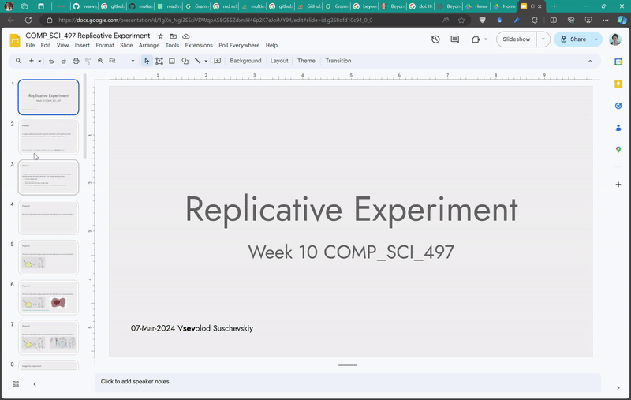

# Replicative experiment [](https://choosealicense.com/licenses/mit/)

We should methodically design experiments with replication as a core
consideration. This repository is a proof-of-concept of what a
replicative experiment could be.

## What is a replicative experiment

The replicative experiment is:

-   Power calculation and simulations
-   Automatic preregistration
-   [Recipe with experimental manipulations](#recipe)
-   [Virtual lab experiment](#virtual-lab)
-   [Script for analysis](#analysis)
-   Budget for replication hackathons

## Demo



## Usage/Examples

### Power calculation

This component is missing from this version

### Preregistration

This component is missing from this version

### Recipe {#recipe}

Should include all axes of experimental manipulation and be accessible
for somebody with no to limited programming experience. For
[example](experiment-core/experiment-recipe.R)

``` r
options_df <- tibble::tibble(
  choiceNames = c(
    "Course introduction", 
    "Reproducibility and replicability", 
    "Adaptive overfitting in explanatory modeling", 
    "Misspecification and underspecification",
    "Mechanism and Causal inference",
    "Interpretability in social science",
    "Interpretability in ML",
    "Generalizability",
    "Project presentations")
)
```

### Virtual lab {#virtual-lab}

In this example I used [shiny](experiment-core/app.R) as a platform, but
anything like [Empirica](https://empirica.ly/),
[oTree](https://www.otree.org/),
[Pushkin](https://languagelearninglab.gitbook.io/pushkin),
[NetLogo](https://ccl.northwestern.edu/netlogo/) should work.

### Analysis {#analysis}

In this example, I started confirmatory analysis in
[experimental-analysis.qmd](experiment-core/experimental-analysis.qmd)
Scripts for analysis should be publicly available, bonded to a virtual
lab, and distributed together. The scripts should be analyzed with
open-source software like R, Python, or Julia, as long as we use R.

### Budget {#budget}

Rich and successful labs could redistribute some amount of taxpayers'
money and citations to others.

## FAQ

#### Why?

Because we need an alternative to mega studies. They work in favour of
centralized and regulated science. I believe in the grassroots and
bottom-up approach.

### Integrative experiments?

[Integrative experiment
design](https://doi.org/10.1017/s0140525x22002874) is great, but we need
to be more radical. Also, it might be hard to define all points in the
experimental design space.

#### Could focus on replications be harmful?

Bad replications are as bad as bad new research.

#### When will it be finished

Ideally, this should be the first chapter of my dissertation.
